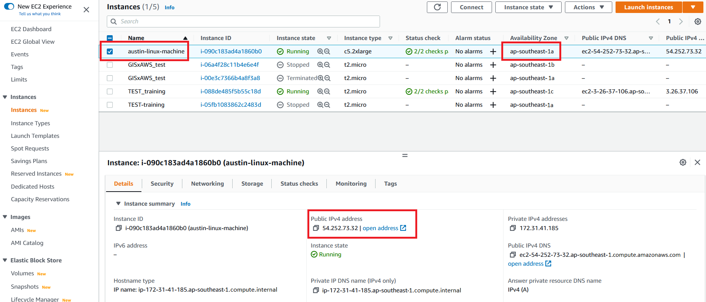

# aws

[**AWS training**](https://d3dxnowv1fnvq7.cloudfront.net/01-hpc-overview.html)

## accessing s3

### 1. Run the AWS CLI command to list all the S3 buckets associated with the account in the region configured with **aws configure**.

```
aws s3 ls
```

### 2. Run AWS CLI commands.

**List the contents of the bucket**

```
aws s3 ls s3://{Bucket Name}
```

Verify that the output includes your uploaded files.

**Download files from the S3 bucket**

To download files we will use the AWS CLI **s3 cp** command.

```
aws s3 cp s3://{Bucket Name}/{object name} ./
```

Verify the download by listing the directory and confirm the object is present.

For more detailed steps on AWS CLI for S3 refer to Section VI ([**Download data shared using Amazon S3**](https://d3dxnowv1fnvq7.cloudfront.net/05-downloaddatafroms3.html)) of the workshop.

**Upload files to the S3 bucket**

To upload files we will use the AWS CLI **s3 cp** command.

```
aws s3 cp ./{your-file} s3://{Bucket Name}/
```

### 3. Verify the contents of the S3 bucket after the copy is completed via command line (below) or by using the AWS Console.

```
aws s3 ls s3://{Bucket Name}
```

## mountpoint for amazon s3

[user guide to installing mountpoint](https://docs.aws.amazon.com/AmazonS3/latest/userguide/mountpoint-installation.html#mountpoint.install.deb)

### 1. Identify your laptop's system configuration

```
uname -a
```

### 2. Mount buckets with the `mount-s3` command

```
mkdir *~/mnt*
mount-s3 *DOC-EXAMPLE-BUCKET* *~/mnt*
```

* replace <mark style="color:orange;">`*DOC-EXAMPLE-BUCKET*`</mark> with the name of your S3 bucket,&#x20;
* replace <mark style="color:orange;">`*~/mnt*`</mark> with the directory on your host where you want your S3 bucket to be mounted.

Because the Mountpoint client runs in the background by default, the `*~/mnt*` directory now gives you access to the objects in your S3 bucket.

After you mount your bucket locally, you can access the objects in your bucket through Mountpoint using common Linux commands, such as `cat` or `ls`, to work with your S3 objects

File system paths are split on the forward slash (`/`) character

For more information, see Mountpoint for Amazon S3 [file system behavior](https://github.com/awslabs/mountpoint-s3/blob/main/doc/SEMANTICS.md) on GitHub. Customers that need richer file system semantics should consider other AWS file services, such as [Amazon Elastic File System (Amazon EFS)](https://aws.amazon.com/efs/)  or [Amazon FSx](https://aws.amazon.com/fsx/).

### 3. Unmount your bucket by using the `umount` command

```
umount *~/mnt*
```

This command unmounts your S3 bucket and exits Mountpoint


## accessing ec2

### 1. [Create a new key pair](https://docs.aws.amazon.com/AWSEC2/latest/UserGuide/create-key-pairs.html)

Obtain a key to allow access to the ec2 instance from your own console

Setting the permissions of the [private key on linux](https://docs.aws.amazon.com/AWSEC2/latest/UserGuide/create-key-pairs.html)

```
chmod 400 key-pair-name.pem
```

### 2. Launch an EC2 instance

In the upper-right corner of the AWS Management Console, confirm you are in the desired AWS region (e.g., Singapore)

Click Launch instance. create your desired virtual machine and select the key pair the instance is associated to, and launch and start the instance

<figure><figcaption></figcaption></figure>

### 3. Login from local computer

```bash
ssh -i /path/my-key-pair.pem ec2-user@<ip-address>
```

* default ec2-user is <mark style="color:orange;">`ubuntu`</mark>, ip-address is <mark style="color:orange;">`ec2-<ipv4>.<instance-region>.<compute.amazonaws.com>`</mark>

```bash
## example
ssh -i "zb4171-lh.pem" ubuntu@ec2-54-254-217-177.ap-southeast-1.compute.amazonaws.com
```

### 4. Setting up environment

Setting up an alignment environment

* [https://biostars.org/p/328831/](https://biostars.org/p/328831/)

```
sudo apt-get update
sudo apt-get install gcc
sudo apt-get install g++
sudo apt-get install make
sudo apt-get install libbz2-dev
sudo apt-get install zlib1g-dev
sudo apt-get install libncurses5-dev 
sudo apt-get install libncursesw5-dev
sudo apt-get install liblzma-dev
```

```
sudo apt-get update
sudo apt-get install gcc
sudo apt install g++
sudo apt install make
sudo apt install samtools
sudo apt install subread

# Get latest STAR source from releases
wget <https://github.com/alexdobin/STAR/archive/2.7.11a.tar.gz>
tar -xzf 2.7.11a.tar.gz
cd STAR-2.7.11a

# Compile <https://github.com/alexdobin/STAR>
cd source
make STAR

chmod +x STAR
```

### 5. Uploading/Downloading data

[https://saturncloud.io/blog/how-to-use-scp-to-copy-a-file-to-amazon-ec2-instance/](https://saturncloud.io/blog/how-to-use-scp-to-copy-a-file-to-amazon-ec2-instance/)

```bash
## copying from local to ec2
scp -i yourkey.pem -r /Users/dir/ ubuntu@ec2-xxxx.amazonaws.com:/home/ubuntu

## copying from ec2 to local
scp -i yourkey.pem -r ubuntu@ec2-xxxx.amazonaws.com:/home/ubuntu /Users/dir/
```


