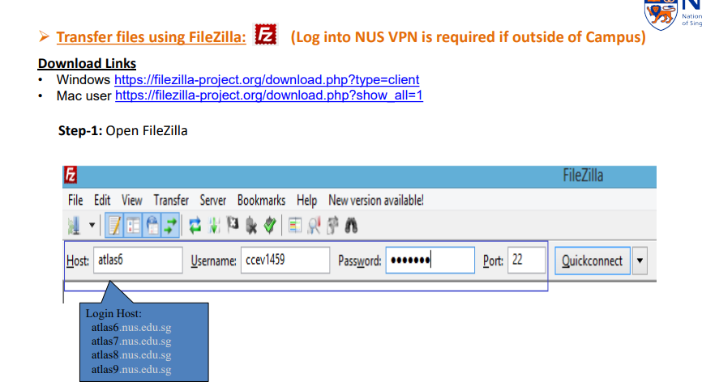
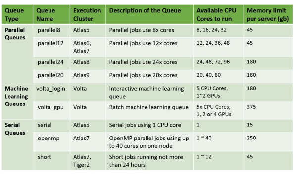
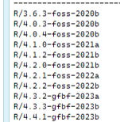

# NUS HPC

[https://hpcportal2.nus.edu.sg/](https://hpcportal2.nus.edu.sg/)

## login (in cmd)

```bash
ssh username@atlas9.nus.edu.sg
```

* basic linux commands on HPC: [https://nusit.nus.edu.sg/wp-content/uploads/2019/09/unixcom.pdf](https://nusit.nus.edu.sg/wp-content/uploads/2019/09/unixcom.pdf)
* Job Submission and Management using PBS Job Scheduler: [https://bobcat.nus.edu.sg/hpc/HPC/pbs/index.html](https://bobcat.nus.edu.sg/hpc/HPC/pbs/index.html)

## installing/loading packages

[https://nusit.nus.edu.sg/technus/getting-access-to-the-latest-scientific-software/](https://nusit.nus.edu.sg/technus/getting-access-to-the-latest-scientific-software/)

```bash
module avail
module load samtools
module load bowtie2
module load bismark
```

## loading data



* Unix based user:
* Can transfer files using scp command
* Example for file upload from local to HPC Home folder
* <mark style="color:red;">`scp file1.txt username@atlas6:./file1.txt`</mark>
* Enter your NUS password when prompted.
* Example for file download from HPC Home folder or workspace /hpctmp folder to local
* <mark style="color:red;">`scp username@atlas6:./file2.txt file2.txt`</mark>
* <mark style="color:red;">`scp username@atlas6:/hpctmp/username/file3.txt file3.txt`</mark>
* Enter your NUS password when prompted

[https://nusit.nus.edu.sg/services/hpc/data-processing-storage-management/high-performance-workspace-for-computational-clusters/](https://nusit.nus.edu.sg/services/hpc/data-processing-storage-management/high-performance-workspace-for-computational-clusters/)

| **Directories**   | **Feature**                | **Disk Quota** | **Backup** | **Description**                                                              |
| ----------------- | -------------------------- | -------------- | ---------- | ---------------------------------------------------------------------------- |
| /home/svu/$USERID | Global                     | 20 GB          | Snapshot   | Home directory, U: drive on your PC. The longest snapshot backup is 10 days. |
| /hpctmp           | Local on All Atlas cluster | 500GB          | No         | Working directory. Files older than 60 days are purged automatically.        |

* check storage using <mark style="color:red;">`hpc s username`</mark>

#### other storage

* scratch - only accessible on atlas9 and volta
*   [https://nusit.nus.edu.sg/technus/accelerating-deep-learning-apps/](https://nusit.nus.edu.sg/technus/accelerating-deep-learning-apps/)


| \*\*\*\*      | **Convenience** | **I/O Performance** | **Remarks**                                  |
| ------------- | --------------- | ------------------- | -------------------------------------------- |
| **/hpctmp**   | High            | Standard            | Accessible from all HPC clusters             |
| **/scratch2** | Standard        | High                | Accessible from atlas9 and Volta GPU cluster |
| **/scratch**  | Low             | High                | Accessible within Volta cluster node         |

\*\* take note

* running on /hpctmp and /scratch2 has slightly different environments?
  * /hpctmp is the main mounted directory
  * hence requires <mark style="color:red;">`automount`</mark> when using /scratch2

## writing job scripts

*   Types of hpc available

    
* steps
  1. select the queue type and resources required
  2. change to working dir <mark style="color:red;">`$PBS_O_WORKDIR`</mark> + get number of CPUs
  3. source <mark style="color:red;">`modules.sh`</mark> to before loading required modules (check using <mark style="color:red;">`module avail`</mark>) + load required modules
     1. to load modules not found, you have to download it to working home directory (e.g. <mark style="color:red;">`/hpctmp/username/`</mark>) and build it beforehand <mark style="color:red;">`export PATH=$PWD/`</mark>
  4. go to working directory + other commands required for the process
     1. logs are saved in directory after the job is done

```bash
#!/bin/bash
#PBS -P bisulfide_seq
#PBS -q parallel20
#PBS -l select=1:ncpus=20:mpiprocs=20:mem=180GB
#PBS -j oe
#PBS -N bisulfide_alignment

cd $PBS_O_WORKDIR
np=$( cat  ${PBS_NODEFILE} |wc -l );  ### get number of CPUs, do not change
source /etc/profile.d/rec_modules.sh
module load samtools
module load bowtie2

cd /hpctmp/username/
export PATH=$PWD/Bismark-0.24.2:${PATH}

cd /hpctmp/username/project/bisulfide
```

## sending job

[https://nusit.nus.edu.sg/technus/alphapulldown-and-pbs-job-arry-demo/](https://nusit.nus.edu.sg/technus/alphapulldown-and-pbs-job-arry-demo/)

[https://rpubs.com/yuweichengnus/747504](https://rpubs.com/yuweichengnus/747504)

PBS stands for Portable Bash System

```bash
# To check and list available queues on the HPC clusters
qstat -q
hpc pbs script parallel12 # checking script

qsub job1.txt / .pbs
qdel
```

## ebenv software environment

[https://bobcat.nus.edu.sg/hpc/support/ebenv/](https://bobcat.nus.edu.sg/hpc/support/ebenv/)

```bash
source /app1/ebenv
```

* only found in certain cluster - e.g. atlas7, atlas9

### running R

[https://bobcat.nus.edu.sg/hpc/support/ebenv/howtos/r/](https://bobcat.nus.edu.sg/hpc/support/ebenv/howtos/r/)



```bash
# load env and desired R 
source /app1/ebenv R-4.4.1

# Trying to load all modules that are compatible with R 4.4.1 ... done, run "module list" to see the full list of loaded modules and e.g. "installed.packages()" in R to see all loaded R packages.

# check env
module list

# start R
R

# in R
installed.packages()

# https://re-docs.genomicsengland.co.uk/enable_rstudio/
```

### R Studio Server

[https://www.hpc.iastate.edu/guides/containers/rstudio](https://www.hpc.iastate.edu/guides/containers/rstudio)

Run `rstudio-server start`, then open a new tab on your preferred browser and type _localhost:8787_

```bash
rstudio-server start
```

## interactive session

* only available on certain clusters, e.g. atlas9-c01

```bash
qsub -I -l select=1:ncpus=1:mem=12GB -l walltime=01:00:00 -P testing -q short
```

## other

[https://webserv-112.nus.edu.sg/login1.php](https://webserv-112.nus.edu.sg/login1.php)

[https://nusit.nus.edu.sg/services/getting-started/introductory-guide-for-new-hpc-users/](https://nusit.nus.edu.sg/services/getting-started/introductory-guide-for-new-hpc-users/)

[https://nusit.nus.edu.sg/wp-content/uploads/2019/09/DL\_on\_CPUs.pdf](https://nusit.nus.edu.sg/wp-content/uploads/2019/09/DL_on_CPUs.pdf)

tutorial

[https://nusit.nus.edu.sg/wp-content/uploads/2019/09/Alphafold-on-NUS-HPC-GPU-Cluster.pdf](https://nusit.nus.edu.sg/wp-content/uploads/2019/09/Alphafold-on-NUS-HPC-GPU-Cluster.pdf)

| **Hostname**          | **Note**                                                     |
| --------------------- | ------------------------------------------------------------ |
| atlas6-c01.nus.edu.sg | HP Xeon two sockets Hexa-Core 64-bit Linux cluster, CentOS 6 |
| atlas7.nus.edu.sg     | HP Xeon two sockets Hexa-Core 64-bit Linux cluster, CentOS 6 |
| atlas8.nus.edu.sg     | HP Xeon two sockets 12-Core 64-bit Linux cluster, CentOS 7.8 |
| atlas9.nus.edu.sg     | HP Xeon two sockets 20-Core 64-bit Linux cluster, CentOS 7.5 |

```
-------------------------------------------------- /app1/modules/centos6.3 --------------------------------------------------
2.2_mvapich_gnu-test        glpk/4.64                   liblbfgs/1.10               pyAnaconda3
3.0_openmpi_gnu-test        gmp/4.3.2                   libxml2/2.7.8               python2.7
abinit_gmp                  GNU_NAG                     lightgbm                    python3.5
amber14_gmp                 GNU_NAG-ORG                 llvm/5.0.1                  python3.6.4
anaconda2                   gnuplot/5.0.5               lpsolve/5.5                 python3.7
anaconda3                   go/1.11.1                   maker-3.1.3                 qhull/7.2.0
arpack-ng/3.7.0             gperf/3.1                   maven/3.5.3                 qrupdate/1.1.2
autoconf/2.69               grace/5.99                  mercurial-4.0.1             qt-4.8.7
automake/1.15               GraphicsMagick/1.3.28       microsoft-R-3.4.1           R-3.0.2
beast-2.3.0                 gromacs465_gmp              microsoft-R-3.4.4           R-3.0.2_test
bison/3.0                   gromacs504_dp_gmp           minisat                     R-3.1.2
boost/1.59.0                gsl/2.7                     mpfr/2.4.2                  R-3.2.5
boost/1.63.0                gsl-1.13                    mpfr/4.0.1                  R-3.5.0
boost/1.67_py2              Gurobi/8.0.0                mvapich2/mvapich2-2.3.2_gnu R-3.6.0
boost/1.67_py3              Gurobi/8.0.1                mvapich2-2.3_gnu            R-4.0.4
boost/boost.test            Gurobi/9.5.1                mvapich2_gnu                rascaf
bzip2/1.0.6                 hdfs/1.10.1                 mysql/5.7.21_test           siesta-4.0
chaste                      interproscan-5              NCL-6.3.0                   siesta-4.1-b3
cmake/3.9.3                 JAGS/4.3.0                  neper-3.3.0                 siesta-4.1-b3-Openmpi
curl-7.57.0                 jre/1.8.0_162               nlopt                       siesta_gmp
delft3d/5.09                jre/jdk-11                  nodejs/8.11.2               singularity/2.5.2
dftbplus/18.1               jre/jdk-13                  nwchem-6.6-gnu              singularity/2.6.0
e2fsprogs/1.44.4            julia/0.5                   octave/4.2.1                singularity/3.1.0
eigen3/3.3.4                julia/0.6                   octave_gnu                  squashtools/4.3
espresso6.2_gmp             julia/1.0.1                 oommf-1.2a5                 SU2/5.0.0
espresso_gmp                julia/1.1.1                 oommf-new                   SU2/6.0.0(default)
falcon                      lammps-29Sep2021            openblas/0.2.20             tcl8.6
ffmpeg/3.3.4                lammps_Dec_2018             opencv/2.4                  Trimmomatic-0.38
fftw/3.3.7                  lammps_gmp                  openmpi/1.8.8               udunits/2.2.26
fltk/1.3.4                  lammps_gmp_2016             openmpi/2.1.1(default)      vampire-4.0.0
gcc-4.7.4                   lammps_gmp_2018             openmpi/3.0.0               vampire-5.0.0
gcc-4.8.2                   lammps_gmp_test             openmpi/3.1.3               VAPOR
gcc-7.3.0                   lapack/3.7.1                openmpi/4.0.0               xcrysden
gdal/2.2.3                  lemon/1.3.1                 openmpi/4.1.1               xz/5.2.3
ghostscript/9.10            libarchive/2.7.0            ovito-2.9                   yasm/1.3.0
git-2.7.0                   libcerf/1.3                 pbs                         zlib/1.2.11
GLIBC_2.14                  libexpat/2.2.6              pcre/8.40                   zlib/1.2.8
GLIBC_2.16                  libgd/2.2.5                 perl5
GLIBC_2.17_UnderTesting     libgeos/3.7.1               proj/5.2.0

----------------------------------------------- /app1/modules/centos6.3-intel -----------------------------------------------
abinit-8.0.8                gromacs504_im               netcdf4331                  vtk7
amber16                     gromacs511_iserial          netcdf460                   waveFoam
cdo-1.8.0                   gromacs514_im               netcdff4.5.2                WRF
espresso5.2-ips             gromacs_imsse               nwchem-6.6_intel            WRF-3.8.1
espresso6.2_intel           intel/xe_2013/openmpi-1.6.3 openbabel/2.3.1             WRF-tmsi
espresso6.3                 Intel_NAG                   openmpi_i                   xe_2015
espresso6.5-Centos6_Intel   intelpython2/2.7.14         openmpi_xe13                xe_2018
espresso6.5-intel_18        intelpython3/3.6.3          R-3.2.3_intel
espresso-if                 molcas-py2.05               R-3.4.3_intel
espresso-ips                mvapich2_i                  suitesparse/5.1.0

--------------------------------------------------- /app1/modules/bioinfo ---------------------------------------------------
aspera                    EMBOSS/6.6.0              mpiBWA                    salmon/1.3.0(default)
augustus/3.3              fastqc/0.11.5(default)    Mummer3/3.23              samtools/0.1.19
bamtools/2.5.1            GapFiller/1.10            nextflow/0.26             samtools/1.6
bbmap/37.99               gatk/3.8                  nextflow/0.31.1           samtools/1.7
bcftools/1.6              gatk/4.0.2.1(default)     nextflow/0.32.0           samtools/1.9(default)
beast2/2.4.8              GMcloser/1.6.2            nextflow/18.10.1          seqmonk/1.44
bedtools/2.25             gridss/1.8.1              nextflow/19.01.0          soap/denovotrans/1.03
bioperl                   hisat2/2.1.0(default)     nextflow/20.01.0(default) spaceranger/1.2.1
bismark/0.22.3(default)   hmmer/3.1                 OPERA-LG/2.0.5            spades/3.0.0
blast+                    htslib/1.8                orthomcl/2.0.9            sratool/3.0.0
blast+_2.12.0             htslib/1.9                oxDNA/2.4_RJune2019_gcc   sratools
bowtie                    IRFinder/1.3.1            oxDNA/2.4_RJune2019_GPU   sspace/long
bowtie2/2.3.3             Jelly2/1.0                oxDNA/2.4_RJune2019_intel sspace/standard
bowtie2/2.4.2(default)    jellyfish/2.2.7           picard/2.16               stacks/2.0.10
BRANCH/1.8.1              jsoncpp                   pindel/0.25b8             STAR/2.5
breakdancer/1.3.6         LoRDEC/0.9                plink/1.9(default)        STAR/2.7.5b(default)
busco/3.0.2               mafft/7.392               plink/2.0                 stringtie/2.1.3b
bwa/0.7.17                mcl/14.137                pmap                      structure/2.3.4
canu/1.7                  meme/4.12.0               proovread/2.14.0          TGICL/2.1
canu/1.7.1                Metassembler/1.5          pyrad/3.0.66              tophat2/2.1.1
cellranger/4.0.0          mhap/2.1.3                RAxML/8.2.11              transrate/1.0.3
cellranger/6.1.2          miniconda/3.6             RAxML/8.2.12_MPI          TrimGalore/0.6.6
cellranger/7.1.0          miniconda/3.8             rdkit/2013_09_1           trinity/2.6.6
cfm-id-code/2.0           miniconda/4.12            rMATS/3.2.5               ucsc_exe
CNVnator/0.4.1            miniconda/4.9(default)    rsem/1.3.0                vcftools/0.1.15
cufflinks/2.2.1           mira/4.0.2                salmon/0.6.1              velvet/1.2.10
DBG2OLC                   mpiBLAST                  salmon/0.9.1              vsearch/2.7.2

----------------------------------------------------- /etc/modulefiles ------------------------------------------------------
mpi/mvapich2-2.0-psm-x86_64  mpi/mvapich2-2.2-psm2-x86_64 mpi/mvapich2-2.2-x86_64      mpi/mvapich2-psm-x86_64
mpi/mvapich2-2.0-x86_64      mpi/mvapich2-2.2-psm-x86_64  mpi/mvapich23-x86_64         mpi/mvapich2-x86_64

--------------------------------------------------- /app1/modules/centos7 ---------------------------------------------------
Abaqus/2021                    GLIBC/2.18                     mumax3/3.10_cuda11             petsc/3.11.4
Abaqus/2022                    gmp/6.2.0                      mvapich2/mvapich2-2.3.2_gnu-c7 proj/7.2.1
Abaqus/2023                    hdf5/1.12.1                    nasm/2.14                      rascaf
Abaqus/cmd-nus                 icu/58.3                       nciplot/4.0                    readline/8.0
abinit/9.4.1                   icu/60.2                       ntl/11.4.3                     root/6.18.02
Ansys/2021R1                   julia/1.3.0                    octave/5.2.0                   singularity/3.7.4
Ansys/2022R1                   julia/1.4.1                    openbabel-3.1.0                singularity/3.8.3(default)      
Ansys/2023R1                   julia/1.5.1                    OpenMolcas/2.08                sqlite3/3.35
cmake/3.20.6                   julia/1.7.1(default)           OpenMolcas/2.19                tclap/1.2.2
cmake/cmake-3.23.1             lammps/29Sep2021               openmpi/3.1.0                  tiff/4.2.0
e2fsprogs/1.46.4               lmdb/0.9.22                    openmpi/4.0.0                  xtb/6.4.1
Gaussian/g09                   Matlab/R2019a                  openmpi/4.1.2                  yeppp/1.0
Gaussian/g16                   Matlab/R2020b                  orca/4.2                       zstd/1.4.8
gcc/7.3.0                      mpich/3.3                      orca/5.0
gcc/9.2.0                      msisensor/0.6                  orca/5.2
gf2x/1.2                       mumax3/3.10beta_cuda10         oxDNA-DEC2013
```
