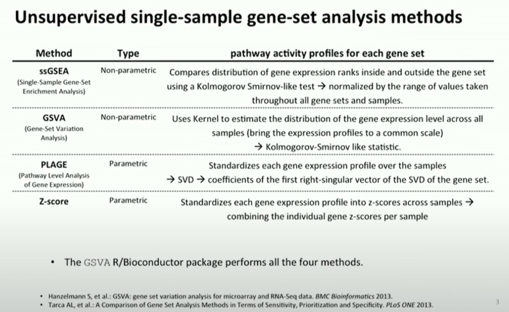

# workflow for ATAC-seq alignment using nextflow

## [Pipeline summary](https://nf-co.re/atacseq/2.1.2/)

<figure><figcaption></figcaption></figure>

<details>

<summary>Details</summary>

1. Raw read QC ([`FastQC`](https://www.bioinformatics.babraham.ac.uk/projects/fastqc/))
2. Adapter trimming ([`Trim Galore!`](https://www.bioinformatics.babraham.ac.uk/projects/trim_galore/))
3. Choice of multiple aligners 1.([`BWA`](https://sourceforge.net/projects/bio-bwa/files/)) 2.([`Chromap`](https://github.com/haowenz/chromap)). **For paired-end reads only working until mapping steps, see** [**here**](https://github.com/nf-core/chipseq/issues/291) 3.([`Bowtie2`](http://bowtie-bio.sourceforge.net/bowtie2/index.shtml)) 4.([`STAR`](https://github.com/alexdobin/STAR))
4. Mark duplicates ([`picard`](https://broadinstitute.github.io/picard/))
5. Merge alignments from multiple libraries of the same sample ([`picard`](https://broadinstitute.github.io/picard/))
   1. Re-mark duplicates ([`picard`](https://broadinstitute.github.io/picard/))
   2. Filtering to remove:
      * reads mapping to mitochondrial DNA ([`SAMtools`](https://sourceforge.net/projects/samtools/files/samtools/))
      * reads mapping to blacklisted regions ([`SAMtools`](https://sourceforge.net/projects/samtools/files/samtools/), [`BEDTools`](https://github.com/arq5x/bedtools2/))
      * reads that are marked as duplicates ([`SAMtools`](https://sourceforge.net/projects/samtools/files/samtools/))
      * reads that are not marked as primary alignments ([`SAMtools`](https://sourceforge.net/projects/samtools/files/samtools/))
      * reads that are unmapped ([`SAMtools`](https://sourceforge.net/projects/samtools/files/samtools/))
      * reads that map to multiple locations ([`SAMtools`](https://sourceforge.net/projects/samtools/files/samtools/))
      * reads containing > 4 mismatches ([`BAMTools`](https://github.com/pezmaster31/bamtools))
      * reads that are soft-clipped ([`BAMTools`](https://github.com/pezmaster31/bamtools))
      * reads that have an insert size > 2kb ([`BAMTools`](https://github.com/pezmaster31/bamtools); _paired-end only_)
      * reads that map to different chromosomes ([`Pysam`](http://pysam.readthedocs.io/en/latest/installation.html); _paired-end only_)
      * reads that arent in FR orientation ([`Pysam`](http://pysam.readthedocs.io/en/latest/installation.html); _paired-end only_)
      * reads where only one read of the pair fails the above criteria ([`Pysam`](http://pysam.readthedocs.io/en/latest/installation.html); _paired-end only_)
   3. Alignment-level QC and estimation of library complexity ([`picard`](https://broadinstitute.github.io/picard/), [`Preseq`](http://smithlabresearch.org/software/preseq/))
   4. Create normalised bigWig files scaled to 1 million mapped reads ([`BEDTools`](https://github.com/arq5x/bedtools2/), [`bedGraphToBigWig`](http://hgdownload.soe.ucsc.edu/admin/exe/))
   5. Generate gene-body meta-profile from bigWig files ([`deepTools`](https://deeptools.readthedocs.io/en/develop/content/tools/plotProfile.html))
   6. Calculate genome-wide enrichment (optionally relative to control) ([`deepTools`](https://deeptools.readthedocs.io/en/develop/content/tools/plotFingerprint.html))
   7. Call broad/narrow peaks ([`MACS2`](https://github.com/macs3-project/MACS))
   8. Annotate peaks relative to gene features ([`HOMER`](http://homer.ucsd.edu/homer/download.html))
   9. Create consensus peakset across all samples and create tabular file to aid in the filtering of the data ([`BEDTools`](https://github.com/arq5x/bedtools2/))
   10. Count reads in consensus peaks ([`featureCounts`](http://bioinf.wehi.edu.au/featureCounts/))
   11. Differential accessibility analysis, PCA and clustering ([`R`](https://www.r-project.org/), [`DESeq2`](https://bioconductor.org/packages/release/bioc/html/DESeq2.html))
   12. Generate ATAC-seq specific QC html report ([`ataqv`](https://github.com/ParkerLab/ataqv))
6. Merge filtered alignments across replicates ([`picard`](https://broadinstitute.github.io/picard/))
   1. Re-mark duplicates ([`picard`](https://broadinstitute.github.io/picard/))
   2. Remove duplicate reads ([`SAMtools`](https://sourceforge.net/projects/samtools/files/samtools/))
   3. Create normalised bigWig files scaled to 1 million mapped reads ([`BEDTools`](https://github.com/arq5x/bedtools2/), [`bedGraphToBigWig`](http://hgdownload.soe.ucsc.edu/admin/exe/))
   4. Call broad/narrow peaks ([`MACS2`](https://github.com/macs3-project/MACS))
   5. Annotate peaks relative to gene features ([`HOMER`](http://homer.ucsd.edu/homer/download.html))
   6. Create consensus peakset across all samples and create tabular file to aid in the filtering of the data ([`BEDTools`](https://github.com/arq5x/bedtools2/))
   7. Count reads in consensus peaks relative to merged library-level alignments ([`featureCounts`](http://bioinf.wehi.edu.au/featureCounts/))
   8. Differential accessibility analysis, PCA and clustering ([`R`](https://www.r-project.org/), [`DESeq2`](https://bioconductor.org/packages/release/bioc/html/DESeq2.html))
7. Create IGV session file containing bigWig tracks, peaks and differential sites for data visualisation ([`IGV`](https://software.broadinstitute.org/software/igv/)).
8. Present QC for raw read, alignment, peak-calling and differential accessibility results ([`ataqv`](https://github.com/ParkerLab/ataqv), [`MultiQC`](http://multiqc.info/), [`R`](https://www.r-project.org/))

</details>

## Running in HPC



### Setting up env in HPC

* [making the pipeline offline](../../others/nextflow-and-nf-core.md#operating-nf-core-offline-in-hpc) - downloads the nextflow pipeline and singularity containers used
* obtain nextflow profile configuration <mark style="color:red;">`.config`</mark> file
* obtaining/uploading the data/parameters required

```bash
# building index
bowtie2-build annotation/GRCh38.primary_assembly.genome.fa GRCh38_v43 --threads 8

# effective genome size <https://deeptools.readthedocs.io/en/develop/content/feature/effectiveGenomeSize.html>
pip install khmer
unique-kmers.py -k 150 -R unique_count /mnt/c/Users/xiaox/Documents/temp/annotation/GRCh38.primary_assembly.genome.fa

# obtaining blacklist bed files
wget -L https://raw.githubusercontent.com/Boyle-Lab/Blacklist/master/lists/hg38-blacklist.v2.bed.gz && gunzip hg38-blacklist.v2.bed.gz
```



### Setting up nf-params file

Sets up the pararmeters and directories of the input/output for the pipeline


```json
{
    "input": "/scratch2/username/atac/samplesheet_ko.csv",
    "read_length": 150,
    "outdir": "/scratch2/username/atac/results",
    "email": "--@gmail.com",
    "multiqc_title": "atacseq",
    "fasta": "/scratch2/username/atac/annotation/GRCh38.primary_assembly.genome.fa",
    "gtf": "/scratch2/username/atac/annotation/gencode.v43.primary_assembly.annotation.gtf",
    "bowtie2_index": "/scratch2/username/atac/annotation/bowtie_id/",
    "macs_gsize": 2861847787.0,
    "blacklist": "/scratch2/username/atac/hg38-blacklist.v3.bed",
    "mito_name": "chrM",
    "save_trimmed": false,
    "aligner": "bowtie2",
    "narrow_peak": true,
    "macs_pvalue": 0.01
}
```




### Submit the job script


```bash
#!/bin/bash
#PBS -P atac
#PBS -q parallel20
#PBS -l select=1:ncpus=20:mpiprocs=20:mem=128GB
#PBS -j oe
#PBS -N MOLM13_KO_samples

cd $PBS_O_WORKDIR
np=$( cat  ${PBS_NODEFILE} |wc -l );  ### get number of CPUs, do not change

### load modules
echo "loading moodules"
source /etc/profile.d/rec_modules.sh
module load singularity/3.8.3
module load jre/jdk-13

# source code
echo "installing validation"
cd /scratch2/username/
/hpctmp/username/nextflow plugin install nf-validation@1.1.3
export NXF_OFFLINE='true'

echo "running nextflow"
cd /scratch2/username/atac
/hpctmp/username/nextflow run /scratch2/username/nf-core-atacseq_2.1.2/2_1_2/ -c hpc.config -params-file "nf-params_ko.json" -w /scratch2/username/atac/work/ko/
```





